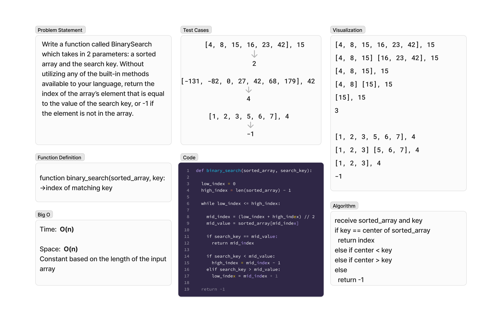

# Array Binary Search
<!-- Description of the challenge -->
Write a function called BinarySearch which takes in 2 parameters: a sorted array and the search key. Without utilizing any of the built-in methods available to your language, return the index of the array’s element that is equal to the value of the search key, or -1 if the element is not in the array.

## Whiteboard Process
<!-- Embedded whiteboard image -->

## Approach & Efficiency
<!-- What approach did you take? Why? What is the Big O space/time for this approach? -->
- Set the low and high index positions (beginning and end of the array)
- In a while loop check to see if the center of the array is greater than or less than the search key
- If the center is greater then search the left half (everything less than center)
- If the center is less then search the right half (everything greater than center)
- Repeat until center matches the search key

## Solution
<!-- Show how to run your code, and examples of it in action -->
The solution for this algorithm is whiteboard only.
