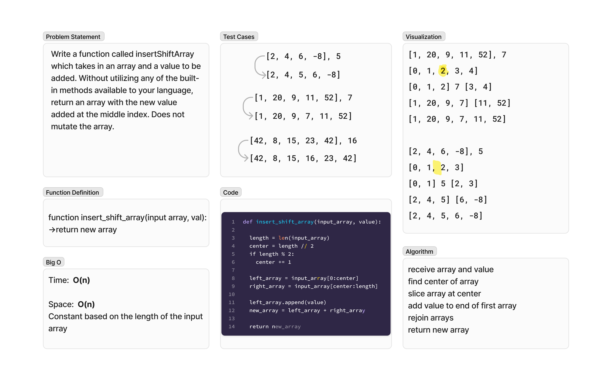

# Array Insert and Shift
<!-- Description of the challenge -->
Write a function called insertShiftArray which takes in an array and a value to be added. Without utilizing any of the built-in methods available to your language, return an array with the new value added at the middle index. Does not mutate the array.

## Whiteboard Process
<!-- Embedded whiteboard image -->

## Approach & Efficiency
<!-- What approach did you take? Why? What is the Big O space/time for this approach? -->
- Determine center of the input array
- Slice the input array at the center to create two arrays, one left of center and the other right of center
- Add the input value to the end of the array from left of center
- Rejoin the sliced arrays

The Big O notation for this algorithm is O(n)

## Solution
<!-- Show how to run your code, and examples of it in action -->
The solution for this algorithm is whiteboard only.
