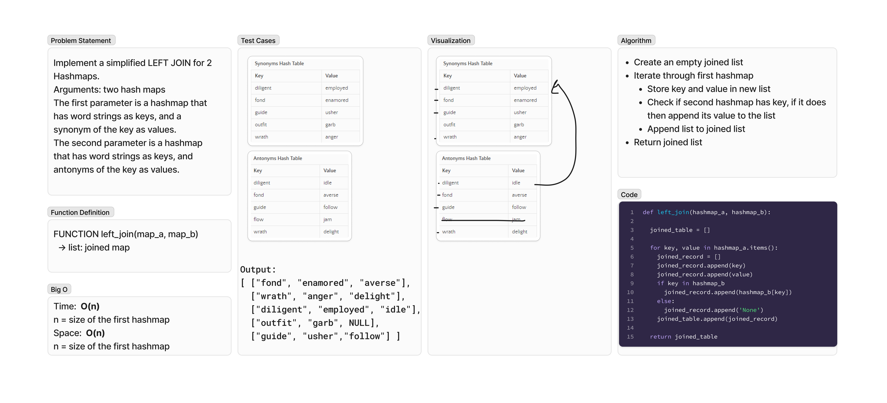

# Hashmap Left Join
<!-- Description of the challenge -->
Implement a simplified LEFT JOIN for 2 Hashmaps.

- Arguments: two hash maps
  - The first parameter is a hashmap that has word strings as keys, and a synonym of the key as values.
  - The second parameter is a hashmap that has word strings as keys, and antonyms of the key as values.

## Whiteboard Process
<!-- Embedded whiteboard image -->

## Approach & Efficiency
<!-- What approach did you take? Why? What is the Big O space/time for this approach? -->
### Algorithm

- Create an empty joined list
- Iterate through first hashmap
  - Store key and value in new list
  - Check if second hashmap has key, if it does then append its value to the list
- Append list to joined list
- Return joined list

### Big O

- Time:  O(n)
  - n = size of the first hashmap
- Space:  O(n)
  - n = size of the first hashmap

## Solution
<!-- Show how to run your code, and examples of it in action -->
To test run `pytest -k left_join` from the `~/python` directory.

[View Code](../../code_challenges/hashtable_left_join.py)
