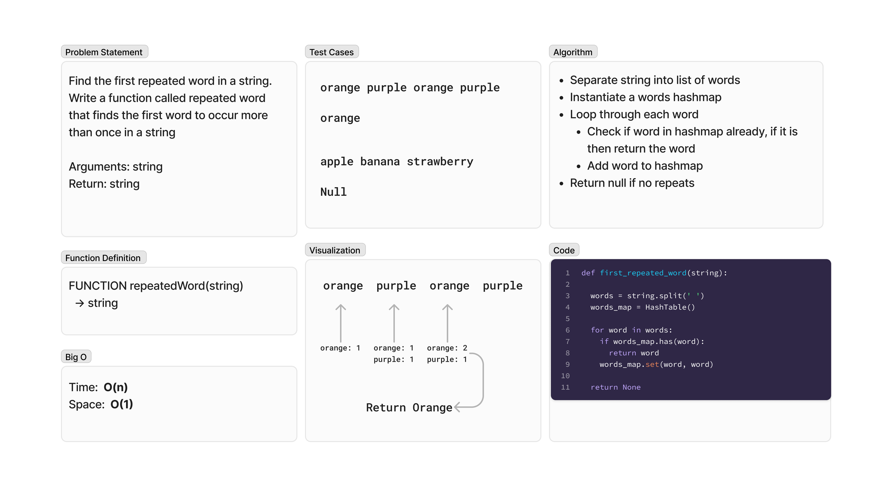

# Hashmap Repeated Word
<!-- Description of the challenge -->
Find the first repeated word in a string. Write a function called repeated word that finds the first word to occur more than once in a string

- Arguments: string
- Return: string

## Whiteboard Process
<!-- Embedded whiteboard image -->

## Approach & Efficiency
<!-- What approach did you take? Why? What is the Big O space/time for this approach? -->
### Algorithm

- Separate string into list of words
- Instantiate a words hashmap
- Loop through each word
- Check if word in hashmap already, if it is then return the word
- Add word to hashmap
- Return null if no repeats

### Big O

- Time:  O(n)
- Space:  O(1)

## Solution
<!-- Show how to run your code, and examples of it in action -->
To test run `pytest -k repeated` from the `~/python` directory.

[View Code](../../code_challenges/hashtable_repeated_word.py)
