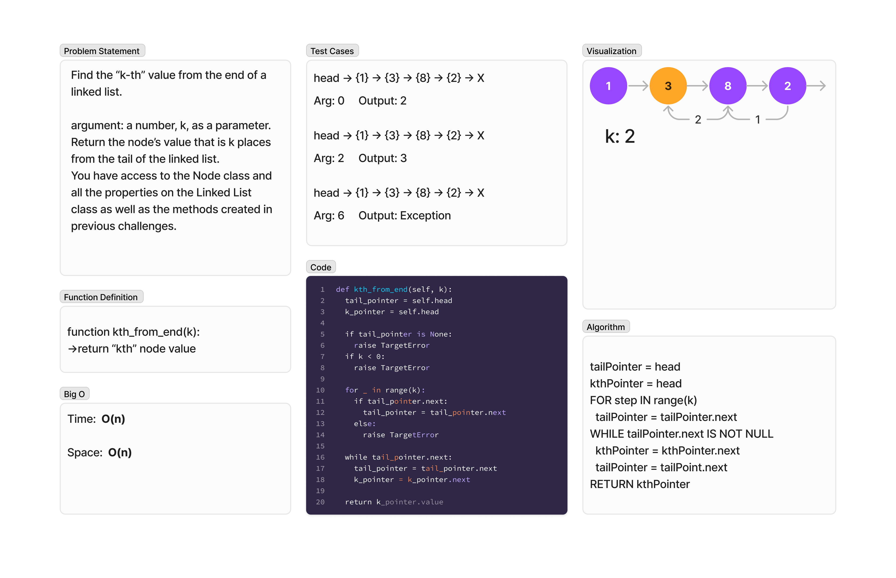

# Linked Lists k-th
<!-- Description of the challenge -->
Find the “k-th” value from the end of a linked list.

`kth_from_end`

- argument: a number, k, as a parameter.
- Return the node’s value that is k places from the tail of the linked list.

## Whiteboard Process
<!-- Embedded whiteboard image -->


## Approach & Efficiency
<!-- What approach did you take? Why? What is the Big O space/time for this approach? -->
### Algorithm

```pseudocode
tailPointer = head
kthPointer = head
FOR step IN range(k)
  tailPointer = tailPointer.next
WHILE tailPointer.next IS NOT NULL
  kthPointer = kthPointer.next
  tailPointer = tailPoint.next
RETURN kthPointer
```

### Big O

- Time:  O(n)
- Space:  O(1)

## Solution
<!-- Show how to run your code, and examples of it in action -->
To test run `pytest -k linked_list` from the `~/python` directory.

[View Code](../../data_structures/linked_list.py)
