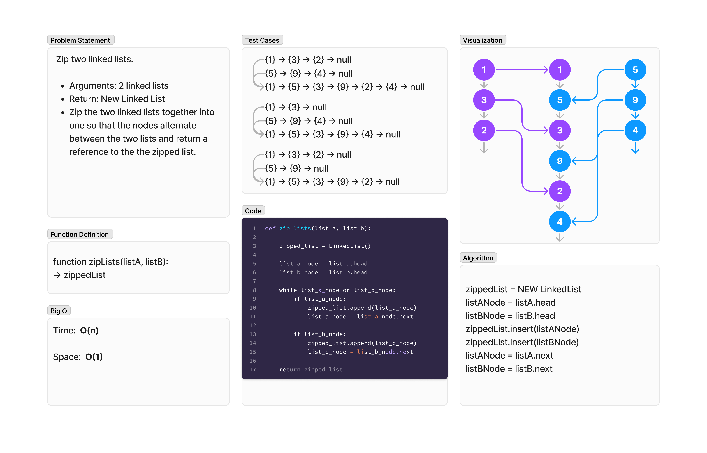

# Linked Lists Zip
<!-- Description of the challenge -->
Zip two linked lists. Zip the two linked lists together into one so that the nodes alternate between the two lists and return a reference to the the zipped list.

`zip_lists`

- Arguments: 2 linked lists
- Return: New Linked List

## Whiteboard Process
<!-- Embedded whiteboard image -->


## Approach & Efficiency
<!-- What approach did you take? Why? What is the Big O space/time for this approach? -->
### Algorithm

```pseudocode
zippedList = NEW LinkedList
listANode = listA.head
listBNode = listB.head
zippedList.append(listANode)
zippedList.append(listBNode)
listANode = listA.next
listBNode = listB.next
```

### Big O

- Time:  O(n)
- Space:  O(1)

## Solution
<!-- Show how to run your code, and examples of it in action -->
To test, run `pytest -k linked_list_zip` from the `~/python` directory.

[View Code](../../code_challenges/linked_list_zip.py)
