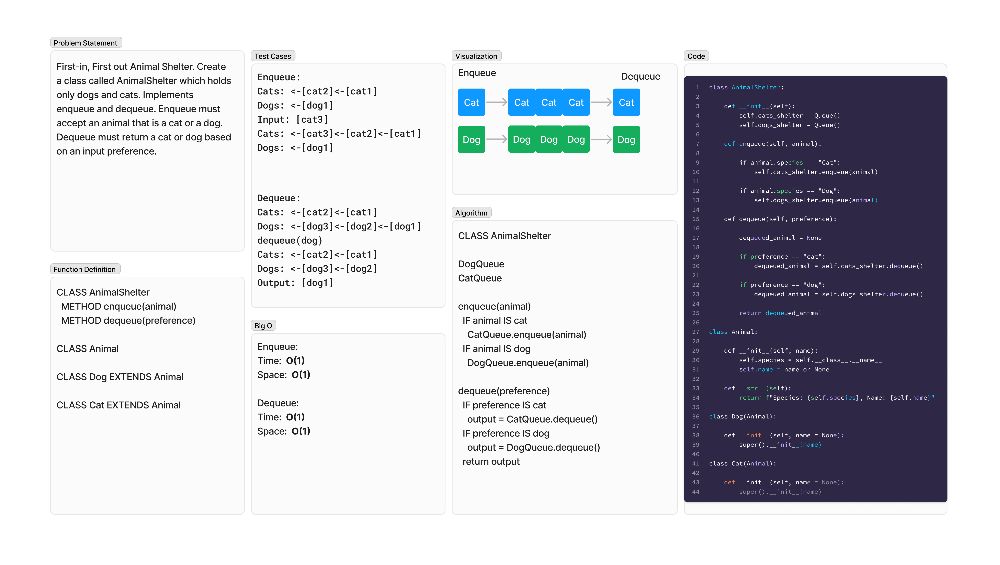

# Animal Shelter
<!-- Description of the challenge -->
First-in, First out Animal Shelter. Create a class called AnimalShelter which holds only dogs and cats. Implements enqueue and dequeue. Enqueue must accept an animal that is a cat or a dog. Dequeue must return a cat or dog based on an input preference.

```pseudocode
CLASS AnimalShelter
  METHOD enqueue(animal)
  METHOD dequeue(preference)

CLASS Animal

CLASS Dog EXTENDS Animal

CLASS Cat EXTENDS Animal
```

## Whiteboard Process
<!-- Embedded whiteboard image -->


## Approach & Efficiency
<!-- What approach did you take? Why? What is the Big O space/time for this approach? -->
### Algorithm

```pseudocode
CLASS AnimalShelter

DogQueue
CatQueue

enqueue(animal)
  IF animal IS cat
    CatQueue.enqueue(animal)
  IF animal IS dog
    DogQueue.enqueue(animal)

dequeue(preference)
  IF preference IS cat
    output = CatQueue.dequeue()
  IF preference IS dog
    output = DogQueue.dequeue()
  return output
```

### Big O

Enqueue:

- Time:  O(1)
- Space:  O(1)

Dequeue:

- Time:  O(1)
- Space:  O(1)

## Solution
<!-- Show how to run your code, and examples of it in action -->
To test run `pytest -k animal` from the `~/python` directory.

[View Code](../../code_challenges/stack_queue_animal_shelter.py)
