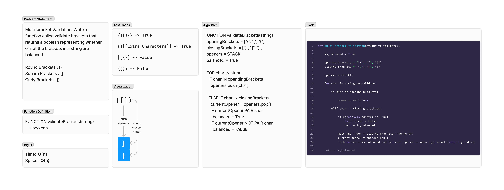

# Brackets Validation
<!-- Description of the challenge -->
Multi-bracket Validation. Write a function called validate brackets that returns a boolean representing whether or not the brackets in a string are balanced.

- Round Brackets : `()`
- Square Brackets : `[]`
- Curly Brackets : `{}`

## Whiteboard Process
<!-- Embedded whiteboard image -->


## Approach & Efficiency
<!-- What approach did you take? Why? What is the Big O space/time for this approach? -->
### Algorithm

```pseudocode
FUNCTION validateBrackets(string)
  openingBrackets = ["(", "[", "{"]
  closingBrackets = [")", "]", "}"]
  openers = STACK
  balanced = True

  FOR char IN string
    IF char IN opendingBrackets
      openers.push(char)

    ELSE IF char IN closingBrackets
      currentOpener = openers.pop()
      IF currentOpener PAIR char
        balanced = True
      IF currentOpener NOT PAIR char
        balanced = FALSE
```

### Big O

- Time:  O(n)
- Space:  O(n)

## Solution
<!-- Show how to run your code, and examples of it in action -->
To test run `pytest -k brackets` from the `~/python` directory.

[View Code](../../code_challenges/stack_queue_brackets.py)
