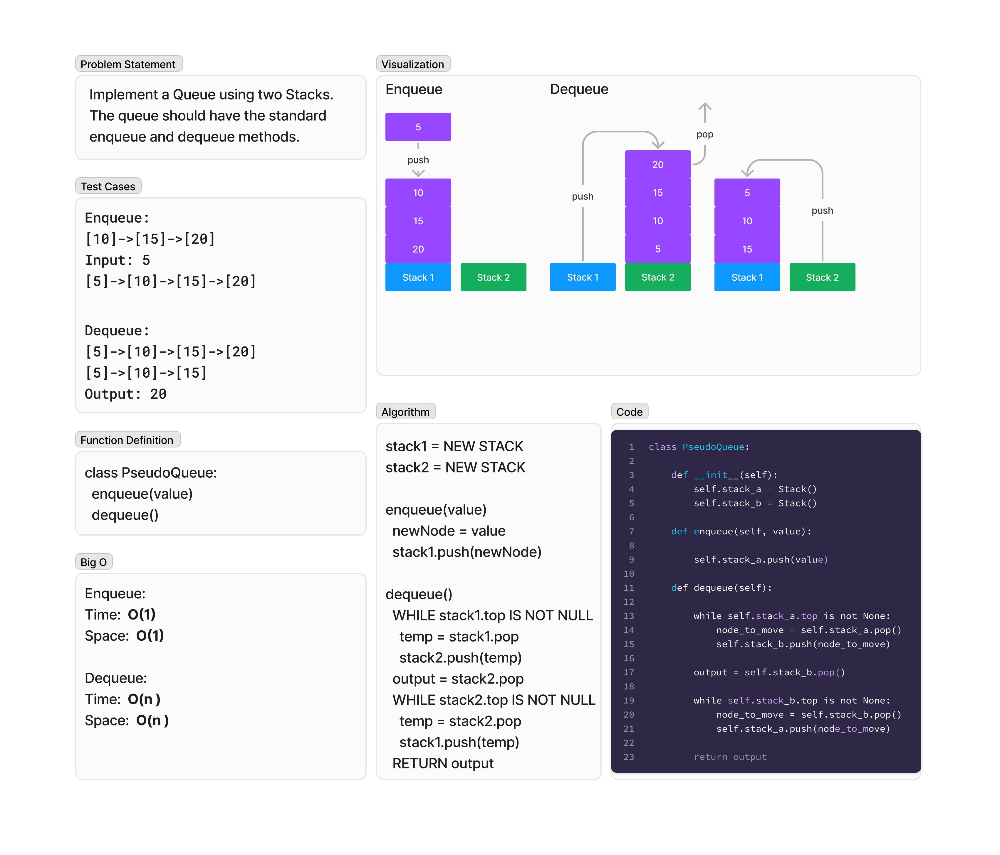

# Pseudo-Queue
<!-- Description of the challenge -->
Implement a Queue using two Stacks. The queue should have the standard enqueue and dequeue methods.

`class PseudoQueue`

## Whiteboard Process
<!-- Embedded whiteboard image -->


## Approach & Efficiency
<!-- What approach did you take? Why? What is the Big O space/time for this approach? -->
### Algorithm

```pseudocode
stack1 = NEW STACK
stack2 = NEW STACK

enqueue(value)
  newNode = value
  stack1.push(newNode)

dequeue()
  WHILE stack1.top IS NOT NULL
    temp = stack1.pop
    stack2.push(temp)
  output = stack2.pop
  WHILE stack2.top IS NOT NULL
    temp = stack2.pop
    stack1.push(temp)
  RETURN output
```

### Big O

Enqueue:

- Time:  O(1)
- Space:  O(1)

Dequeue:

- Time:  O(n)
- Space:  O(n)

## Solution
<!-- Show how to run your code, and examples of it in action -->
To test run `pytest -k pseudo` from the `~/python` directory.

[View Code](../../code_challenges/stack_queue_pseudo.py)
