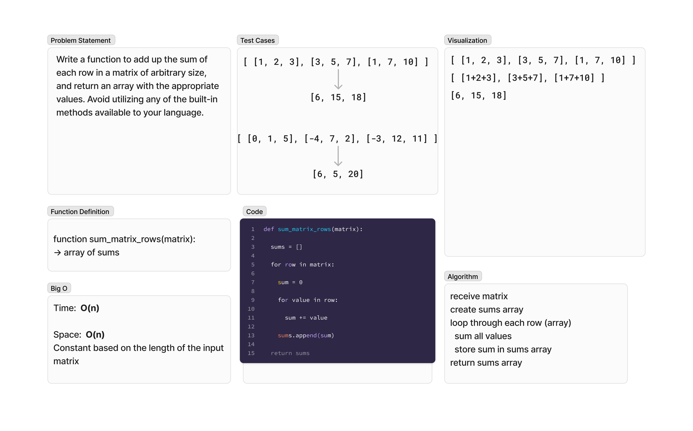

# Sum Matrix Rows
<!-- Description of the challenge -->
Write a function to add up the sum of each row in a matrix of arbitrary size, and return an array with the appropriate values. Avoid utilizing any of the built-in methods available to your language.

## Whiteboard Process
<!-- Embedded whiteboard image -->

## Approach & Efficiency
<!-- What approach did you take? Why? What is the Big O space/time for this approach? -->
- Create a sums array to store the sums
- Loop through each row (array) in the matrix
  - Loop through each value in the current row and sum each value together, store this sum in the sums array

## Solution
<!-- Show how to run your code, and examples of it in action -->
The solution for this algorithm is whiteboard only.
