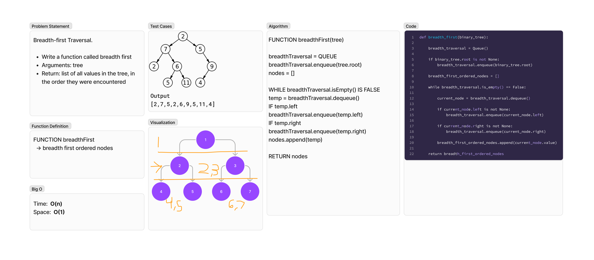

# Tree Breadth First Traversal
<!-- Description of the challenge -->
Breadth-first Traversal.

- Write a function called breadth first
- Arguments: tree
- Return: list of all values in the tree, in the order they were encountered

## Whiteboard Process
<!-- Embedded whiteboard image -->


## Approach & Efficiency
<!-- What approach did you take? Why? What is the Big O space/time for this approach? -->
### Algorithm

```pseudocode
FUNCTION breadthFirst(tree)

breadthTraversal = QUEUE
breadthTraversal.enqueue(tree.root)
nodes = []

WHILE breadthTraversal.isEmpty() IS FALSE
temp = breadthTraversal.dequeue()
IF temp.left
breadthTraversal.enqueue(temp.left)
IF temp.right
breadthTraversal.enqueue(temp.right)
nodes.append(temp)

RETURN nodes
```

### Big O

- Time:  O(n)
- Space:  O(1)

## Solution
<!-- Show how to run your code, and examples of it in action -->
To test run `pytest -k tree_breadth` from the `~/python` directory.

[View Code](../../code_challenges/tree_breadth_first.py)
