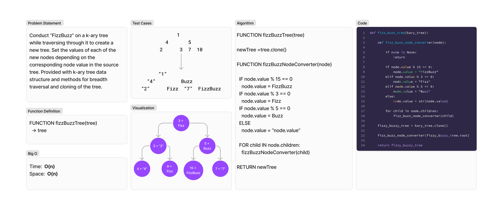

# Tree Fizz Buzz
<!-- Description of the challenge -->
Conduct “FizzBuzz” on a k-ary tree while traversing through it to create a new tree. Set the values of each of the new nodes depending on the corresponding node value in the source tree. Provided with k-ary tree data structure and methods for breadth traversal and cloning of the tree.

## Whiteboard Process
<!-- Embedded whiteboard image -->


## Approach & Efficiency
<!-- What approach did you take? Why? What is the Big O space/time for this approach? -->
### Algorithm

```pseudocode
FUNCTION fizzBuzzTree(tree)

newTree =tree.clone()

FUNCTION fizzBuzzNodeConverter(node)

  IF node.value % 15 == 0
    node.value = FizzBuzz
  IF node.value % 3 == 0
    node.value = Fizz
  IF node.value % 5 == 0
    node.value = Buzz
  ELSE
    node.value = “node.value”

  FOR child IN node.children:
    fizzBuzzNodeConverter(child)

RETURN newTree
```

### Big O

- Time:  O(n)
- Space:  O(n)

## Solution
<!-- Show how to run your code, and examples of it in action -->
To test run `pytest -k fizz` from the `~/python` directory.

[View Code](../../code_challenges/tree_fizz_buzz.py)
