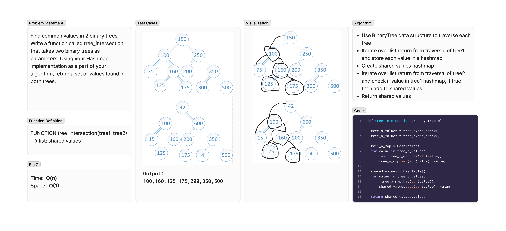

# Tree Map
<!-- Description of the challenge -->
Find common values in 2 binary trees. Write a function called tree_intersection that takes two binary trees as parameters. Using your Hashmap implementation as a part of your algorithm, return a set of values found in both trees.

## Whiteboard Process
<!-- Embedded whiteboard image -->

## Approach & Efficiency
<!-- What approach did you take? Why? What is the Big O space/time for this approach? -->
### Algorithm

- Use BinaryTree data structure to traverse each tree
- Iterate over list return from traversal of tree1 and store each value in a hashmap
- Create shared values hashmap
- Iterate over list return from traversal of tree2 and check if value in tree1 hashmap, if true then add to shared values
- Return shared values

### Big O

- Time:  O(n)
- Space:  O(1)

## Solution
<!-- Show how to run your code, and examples of it in action -->
To test run `pytest -k intersection` from the `~/python` directory.

[View Code](../../code_challenges/tree_intersection.py)
