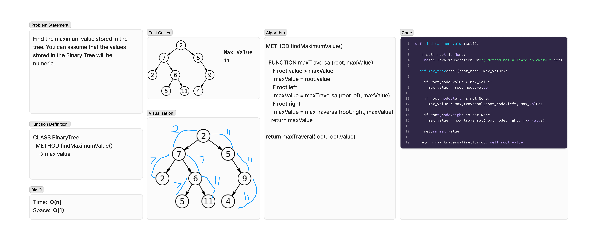

# Tree Max Value
<!-- Description of the challenge -->
Find the maximum value stored in the tree. You can assume that the values stored in the Binary Tree will be numeric.

## Whiteboard Process
<!-- Embedded whiteboard image -->


## Approach & Efficiency
<!-- What approach did you take? Why? What is the Big O space/time for this approach? -->
### Algorithm

```pseudocode
METHOD findMaximumValue()

  FUNCTION maxTraversal(root, maxValue)
    IF root.value > maxValue
      maxValue = root.value
    IF root.left
      maxValue = maxTraversal(root.left, maxValue)
    IF root.right
      maxValue = maxTraversal(root.right, maxValue)
    return maxValue

return maxTraveral(root, root.value)
```

### Big O

- Time:  O(n)
- Space:  O(1)

## Solution
<!-- Show how to run your code, and examples of it in action -->
To test run `pytest -k tree_max` from the `~/python` directory.

[View Code](../../data_structures/binary_tree.py)
